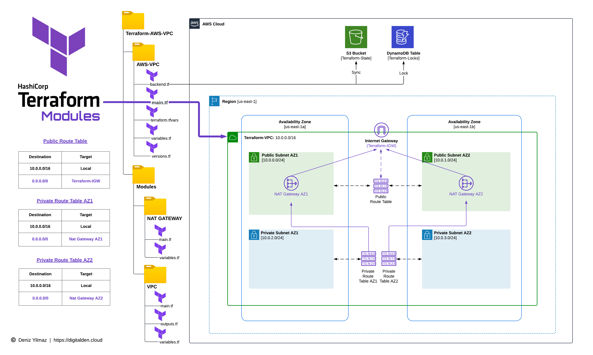

<h1 align="center">Terraform Modules AWS VPC</h1>

    Create and Deploy Reusable Amazon VPC and NAT Gateway Module using Terraform Modules

## Project Date
- 20 September 2023

## Tech Stack
- Terraform
- Amazon VPC
- NAT gateways

## Video Demo
🔗 [The Complete Guide: Creating and Deploying Reusable Amazon VPC & NAT Gateway Modules with Terraform](https://www.youtube.com/watch?v=tb7a0QXUaOM)

## Overivew
Welcome to the GitHub repository that hosts the AWS CLI Commands used to configure a Terraform backend using S3 and DynamoDB, along with Terraform Resource Blocks for creating VPCs, and NAT gateway modules using Terraform Modules.

The content in the video demo encompasses the entire process, starting from setting up the Terraform project structure in Visual Studio Code, configuring an AWS remote backend, creating reusable modules for VPC and NAT gateways, defining Terraform variables, and overseeing the complete deployment process.

The video demonstration guides you through the entire process, starting from scratch. The hands-on experience will help you master the art of writing and managing Terraform code. The structured approach ensures you gain a comprehensive understanding of the process from start to finish.

